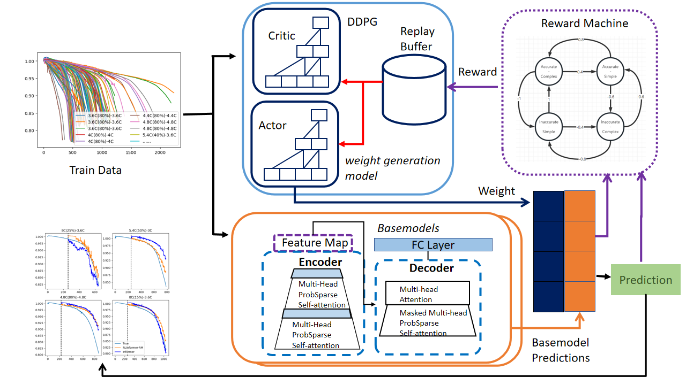

## RLInformer-RM: Lithium-Ion Battery State of Charge Early Prediction based on Reinforcement Learning

This is a PyTorch implementation of  model  RLInformer-RM and discussion experiments proposed by our paper "RLInformer-RM: Lithium-Ion Battery State of Charge Early Prediction based on Reinforcement Learning".

### 1. Overview

<div>			<!--块级封装-->
    <center>	<!--将图片和文字居中-->
    
    <br>		<!--换行-->
    Fig.1 An overview of RLInformer-RM model.	<!--标题-->
    </center>
</div>

To avoid error accumulation and the difficulty of fitting SOC curves using a single model across varying experimental conditions, we propose a multi-model ensemble approach that leverages the Informer model as the base, which is well-suited for long-term forecasting. The base models are trained on datasets with diverse distributions, while Deep Deterministic Policy Gradient (DDPG) is utilized as a weight generation mechanism to combine the base models' predictions. To prevent DDPG from becoming trapped in local optima during training, both the accuracy and complexity of the DDPG-generated weights are considered. Finally,we proposed RLInformer-RM (Reinforcement Learning Informer with Reward Machine) as a novel solution to enhance SOC prediction performance.

### 2. Installation

Set up a python environment for version 3.10.9 and clone the Github repo.

```
$ pip install -r ./requirements.txt
```

### 3.Datasets

You can download the datasets via reference URL in the follow table.

|  <span style="display:inline-block;width:150px">Datasets</span>                         |                         <span style="display:inline-block;width:250px">Description</span>                          |     Type      |                          Reference                           |
| :-----------------------------: | :------------------------------------------: | :------------: | :-----------------------------------: |
| Dataset A | Dataset A is provided by the Mechanics Institute of Shanghai University.A total of 42 batteries’ SOC data were recorded during the experiment. | Private |              https://github.com/zl-chen/shu_battery_data              |
|            Dataset B             |   Dataset B was measured on a battery with a nominal capacity of 1.1 Ah and a nominal voltage of 3.3 V.In total, Dataset B contains 135 SOC curves.   | Public | https://data.matr.io/1/projects/5d80e633f405260001c0b60a |

Dataset A is private data. If needed, please contact the authors via email.

### 4. Training 

To train the RLInformer-RM, you have to exec the following commands.

```
# train basemodel
$ cd basemodels/
$ ./run.sh

# train weight generation model
$ cp ./checkpoints/basemodel/* ../weight_generation_models/basemodels/
$ cd ../weight_generation_models
$ mkdir basemodels/remove_model
$ mv basemodels/model_remove* basemodels/remove_model/*
$ python rlmc_battery.py
```


